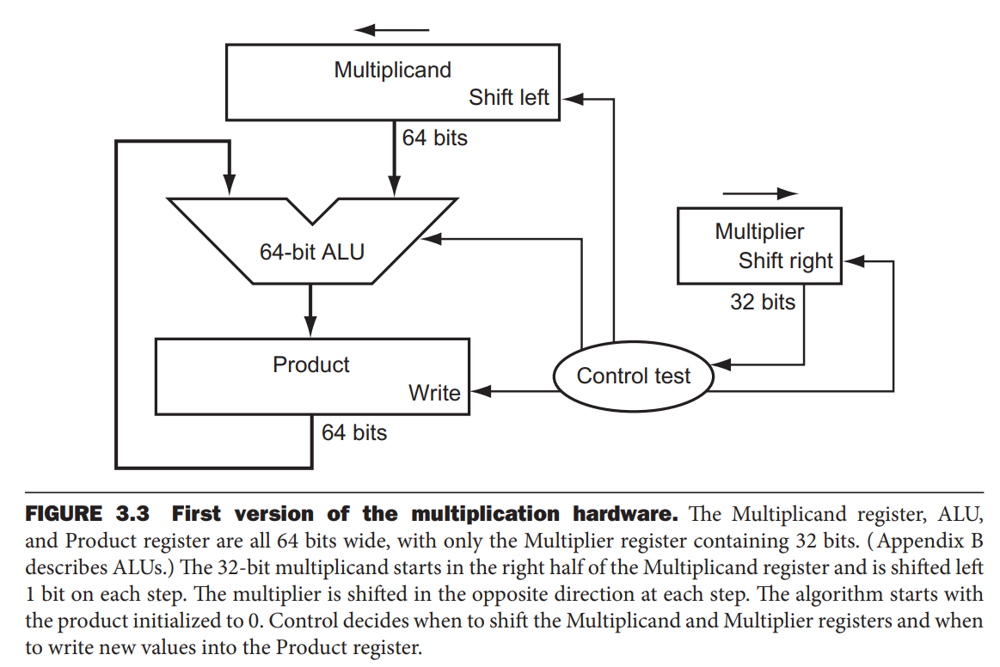
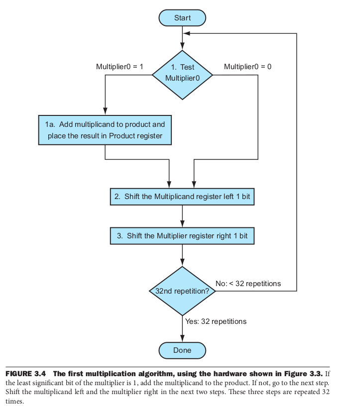
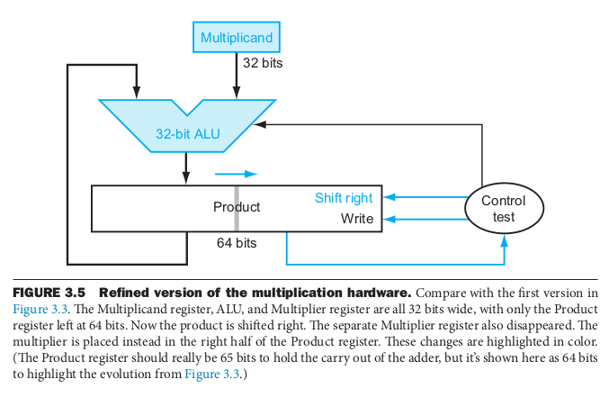

## 3.1 서론

 
이 장에서는 실수의 표현과 연산 알고리즘, 이러한 알고리즘을 수행하는 하드웨어, 그리고 이 모든 것들이 명령어 집합에 미치는 영향 등을 다룬다. 
 
 

## 3.2 덧셈과 뺄셈

 
컴퓨터는 사람들이 생각하는 그대로 덧셈을 수행한다. 즉, 초등학교에서 배운 산수와 다를 바가 없다. 
다만, 뺄셈은 뺄 값의 부호를 바꾼 뒤 덧셈을 이용한다. 
 

#### 덧셈과 뺄셈 예제

 
십진수 2와 십진수 10을 이진법으로 덧셈과 뺄셈을 해보자. 하위 몇 비트를 제외한 상위 비트들은 생략한다. 
 
- 덧셈 
 
&nbsp;&nbsp;&nbsp;&nbsp;0000 0010 
+&nbsp;&nbsp;&nbsp;0000 1010 
\-\-\-\-\-\-\-\-\-\-\-\-\-\-\-\-\-\-\-\-\-  
&nbsp;&nbsp;&nbsp;&nbsp;0000 1100 
 
만약 바로 한 단계 아랫 자리에서 올림수가 발생했다면, 그 올림수와 현재 자리수의 계산 값을 더한다. 
 
- 뺄셈 
 
&nbsp;&nbsp;&nbsp;&nbsp;0000 0010 
-&nbsp;&nbsp;&nbsp;0000 1110 
\-\-\-\-\-\-\-\-\-\-\-\-\-\-\-\-\-\-\-\-\-  
&nbsp;&nbsp;&nbsp;&nbsp;0000 1100 
 
뺄셈은 뺄 값의 부호를 바꾼 뒤(0000 1010 -> 1111 0110) 두 수를 더한다. 
 
&nbsp;&nbsp;&nbsp;&nbsp;0000 0010 
+&nbsp;&nbsp;&nbsp;1111 0110 
\-\-\-\-\-\-\-\-\-\-\-\-\-\-\-\-\-\-\-\-\-  
&nbsp;&nbsp;&nbsp;&nbsp;1111 1000 
 
2+10=12 (이진수로 0000 1100), 2-10=-8 (이진수로 1111 1000)이므로 결과가 기대한 것과 같다. 
 

#### 오버플로우가 발생하는 조건과 탐지 방법

 
부호 있는 덧셈과 뺄셈에서는, 
A+B 덧셈에서 오버플로우가 발생하려면, a. A>=0이고 B>=0일 때, 또는 b. A<0이고 B<0일 때 발생한다. 
이때, a.의 경우에서 두 양수를 더한 값이 음수가 되거나, b.의 경우에서 두 음수를 더한 값이 양수가 되었을 때 오버플로가 발생했다는 사실을 탐지할 수 있다. 
A-B 뺄셈에서 오버플로우가 발생하려면, a. A>=0이고 B<0일 때, 또는 b. A<0이고 B>=0일 때 발생한다. 
이때, a.의 경우에서 양수에서 음수를 뺀 값이 음수가 되거나, b.의 경우에서 음수에서 양수를 뺀 값이 양수가 되었을 때 오버플로가 발생했다는 사실을 탐지할 수 있다. 
반면 부호 없는 덧셈과 뺄셈에서는 오버플로우를 무시한다. 
 
부호 있는 덧뺄셈에서는 컴퓨터가 오버플로우를 인식하고, 부호 없는 덧뺄셈에서는 오버플로우를 무시해야 한다. 
MIPS에서는 두 가지 경우를 지원하기 위해 산술 명령어를 부호의 여부에 따라 나눈다. (e.g. `add`와 `addu`) 
`add`, `addi`, `sub` 명령어는 오버플로가 발생하면 예외(exception)을 발생시킨다. 
하지만 부호 없는 덧뺄셈 명령어 `addu`,`addiu`, `subu`는 오버플로우를 무시한다. 
 
 

## 3.3 곱셈

 

#### 곱셈 예제

 
곱셈의 경우도 덧셈과 마찬가지로, 우리가 초등학교 산수에서 배웠던 것과 같은 방식으로 연산을 하게 된다. 
예를 들어 십진수 1000과 1001을 곱해보자. 
 
&nbsp;&nbsp;&nbsp;&nbsp;&nbsp;&nbsp;&nbsp;&nbsp;1000 
&nbsp;&nbsp;&nbsp;&nbsp;x&nbsp;&nbsp;&nbsp;1001 
\-\-\-\-\-\-\-\-\-\-\-\-\-\-\-\-\-\-\-\-\-  
&nbsp;&nbsp;&nbsp;&nbsp;&nbsp;&nbsp;&nbsp;&nbsp;1000 
&nbsp;&nbsp;&nbsp;&nbsp;&nbsp;&nbsp;&nbsp;0000 
&nbsp;&nbsp;&nbsp;&nbsp;&nbsp;&nbsp;0000 
&nbsp;&nbsp;&nbsp;&nbsp;&nbsp;1000 
\-\-\-\-\-\-\-\-\-\-\-\-\-\-\-\-\-\-\-\-\- 
&nbsp;&nbsp;&nbsp;&nbsp;&nbsp;1001000 
 
여기서 첫 번째 피연산자(1000)는 `피승수`(`multiplicand`)라고 부르고, 두 번째 피연산자(1001)는 `승수`(`muiltiplier`)라고 부른다. 
최종 결과는 `곱`(`product`)이라고 한다. 
위 곱셈에서 둘째 피연산자의 자리 수가 1이면 첫째 피연산자(1000*1=1000)를 밑의 해당 위치에 썼고, 둘째 피연산자의 자리 수가 0이면 0(1000*0=0000)을 밑의 해당 위치에 썼다. 
위는 십진수 곱셈임에도 설명의 편의를 위해 0과 1만을 사용했지만, 실제로도 2진수 곱셈에서는 위와 같은 방법으로 곱셈을 한다. 
 
 

#### 곱셈 알고리즘과 하드웨어

 

 
위 그림은 순차적으로 곱셈을 수행하는 하드웨어를 간단히 설계한 것이다. 
첫째 피연산자는 Multicand 레지스터의 하위 32비트에, 둘째 피연산자는 Multiplier 레지스터에 있다. 그리고 Product 레지스터(결과값)는 0으로 초기화되어 있다고 하자. 
위 곱셈 예제의 계산 방법대로라면, 매 단계마다 첫째 피연산자를 왼쪽으로 한자리씩 이동시킨 값들을(1000, 00000, 000000, 1000000) 모두 더해줘야 한다. (1001000) 
따라서 매 단계마다 첫째 피연산자는 왼쪽으로 자리이동하고, 둘째 피연산자는 오른쪽으로 자리이동하면서 첫째 피연산자에 곱할 값(0 또는 1)을 최하위 비트에 둔다. 
둘째 피연산자가 들어있었던 레지스터의 최하위 비트가 1이라면, 첫째 피연산자가 들어있었던 64비트 레지스터의 값을 결과값에 더한다. 
위 단계를 32번 실행한다면 모든 32비트에 대한 곱 연산이 끝나는 것이다. 
아래는 위 과정을 flow chart로 나타낸 것이다. 첫 번째 단계에서는 최하위 비트를 검사하고 필요 시 결과값 레지스터에 더하고, 두 번째와 세 번째 단계에서는 각각 Multicand와 Multiplier 레지스터를 왼쪽과 오른쪽으로 자리이동한다. 
 

 
그런데 위와 같은 계산 방법으로는 (각 단계에 한 클럭 사이클이 필요하다고 가정했을 때) 곱셈 하나를 수행하는 데 3\*32=96개 사이클이 필요하게 된다. 하지만 각 단계는 이전 계산 결과에 영향을 받지 않고 독립적으로 계산이 가능하므로 쉽게 병렬화가 가능하다. 
둘째 피연산자의 32개 비트 각각을 조사하여 곰셈을 시작하는 초기에 첫째 피연산자가 더해져야 하는지 아닌지 판단하고, 둘째 피연산자 32비트에 덧셈기를 하나씩 할당한 뒤, 두 덧셈기의 출력을 또다른 덧셈기의 입력으로 만드는, 즉 병렬 트리 구조로 만드는 방식으로 곱셈을 빠르게 할 수 있다. 
이렇게 한다면 모든 32비트 곱셈이 5번의 덧셈만으로(log_2(32)=5) 가능해진다. 
 

 
또한, 위에서 보인 하드웨어 설계는 위와 같이 개선될 수 있다. 이 설계에서는 첫째 피연산자를 64비트가 아닌 32비트 레지스터에 저장하고, 둘째 피연산자를 별도의 레지스터에 저장하는 것이 아닌 Product(결과값) 레지스터의 하위 32비트에 넣어놓는다. 
Product 레지스터에는 처음에는 상위 32비트/하위 32비트를 각각 결과값과 둘째 피연산자를 저장하는 데에 사용하다가, 매 단계마다 오른쪽으로 자리이동시켜 (33비트/31비트, 34비트/30비트, ...) 32단계 뒤에는 Product 레지스터에 64비트의 결과값만이 남게 된다. 
이러한 설계의 변화는 덧셈기와 레지스터의 폭을 절반으로 줄이고 매 반복이 한 클럭 사이클만 걸리도록 하는 개선 효과를 준다. 
 

#### 부호 있는 곱셈

 
위에서 지금까지 다룬 것은 부호 없는 수의 곱셈이었다. 
만약 부호 있는 곱셈을 하려고 한다면, 두 피연산자를 양수로 변환하고, 원래의 부호를 기억한 뒤, 부호를 제외한 31비트를 계산하고 만약 피연산자들의 부호가 서로 다를 때 결과값을 음수로 바꾸면 된다. 
 
 

## 3.4 나눗셈

 

#### 나눗셈 예제

 
이 절에서도 먼저 초등학교에서 배운 방식으로 1001010을 1000으로 나눠보자. 
 
&nbsp;&nbsp;&nbsp;&nbsp;&nbsp;&nbsp;&nbsp;&nbsp;&nbsp;&nbsp;1000 
&nbsp;&nbsp;&nbsp;&nbsp;&nbsp;\-\-\-\-\-\-\-\-\-\-\-\-\-\-\-\-\-\-\-\-\-\-  
1000 ) 1001010 
&nbsp;&nbsp;&nbsp;&nbsp;- 1000 
&nbsp;&nbsp;&nbsp;&nbsp;&nbsp;\-\-\-\-\-\-\-\-\-\-\-\-\-\-\-\-\-\-\-\-\-\-  
&nbsp;&nbsp;&nbsp;&nbsp;&nbsp;&nbsp;&nbsp;&nbsp;&nbsp;&nbsp;1010 
&nbsp;&nbsp;&nbsp;&nbsp;&nbsp;&nbsp;&nbsp;&nbsp;&nbsp;&nbsp;1000 
&nbsp;&nbsp;&nbsp;&nbsp;&nbsp;&nbsp;&nbsp;&nbsp;\-\-\-\-\-\-\-\-\-\-\-\-\-\-\-\-  
&nbsp;&nbsp;&nbsp;&nbsp;&nbsp;&nbsp;&nbsp;&nbsp;&nbsp;&nbsp;&nbsp;&nbsp;10 
 

 
 

## 3.5 부동소수점

## 3.6 병렬성과 산술연산: 서브워드 병렬성

## 3.8 더 빠르게: 서브워드 병렬성과 행렬 곱셈

## 3.9 오류와 함정

## 3.10 결론

