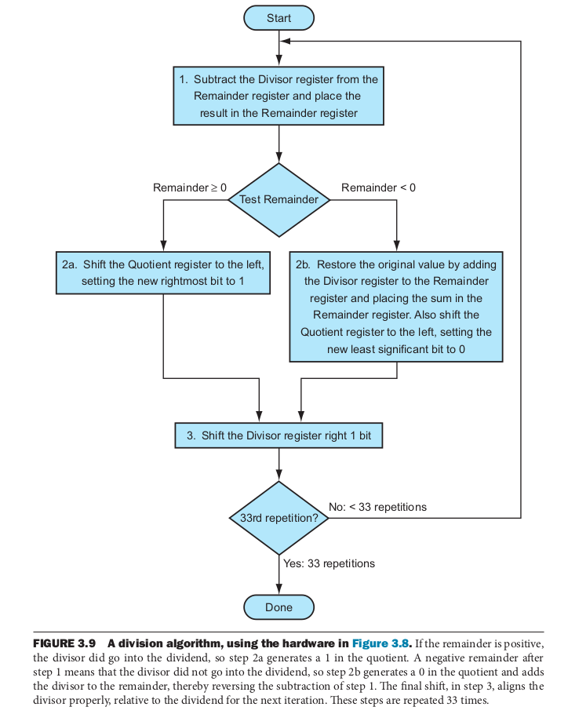

## 3.1 서론

 
이 장에서는 실수의 표현과 연산 알고리즘, 이러한 알고리즘을 수행하는 하드웨어, 그리고 이 모든 것들이 명령어 집합에 미치는 영향 등을 다룬다. 
 
 

## 3.2 덧셈과 뺄셈

 
컴퓨터는 사람들이 생각하는 그대로 덧셈을 수행한다. 즉, 초등학교에서 배운 산수와 다를 바가 없다. 
다만, 뺄셈은 뺄 값의 부호를 바꾼 뒤 덧셈을 이용한다. 
 

#### 덧셈과 뺄셈 예제

 
십진수 2와 십진수 10을 이진법으로 덧셈과 뺄셈을 해보자. 하위 몇 비트를 제외한 상위 비트들은 생략한다. 
 
- 덧셈 
 
&nbsp;&nbsp;&nbsp;&nbsp;0000 0010 
+&nbsp;&nbsp;&nbsp;0000 1010 

\-\-\-\-\-\-\-\-\-\-\-\-\-\-\-\-\-\-\-\-\-  

&nbsp;&nbsp;&nbsp;&nbsp;0000 1100 
 
만약 바로 한 단계 아랫 자리에서 올림수가 발생했다면, 그 올림수와 현재 자리수의 계산 값을 더한다. 
 
- 뺄셈 
 
&nbsp;&nbsp;&nbsp;&nbsp;0000 0010 
-&nbsp;&nbsp;&nbsp;0000 1110 

\-\-\-\-\-\-\-\-\-\-\-\-\-\-\-\-\-\-\-\-\-  

&nbsp;&nbsp;&nbsp;&nbsp;0000 1100 
 
뺄셈은 뺄 값의 부호를 바꾼 뒤(0000 1010 -> 1111 0110) 두 수를 더한다. 
 
&nbsp;&nbsp;&nbsp;&nbsp;0000 0010 
+&nbsp;&nbsp;&nbsp;1111 0110 

\-\-\-\-\-\-\-\-\-\-\-\-\-\-\-\-\-\-\-\-\-  

&nbsp;&nbsp;&nbsp;&nbsp;1111 1000 
 
2+10=12 (이진수로 0000 1100), 2-10=-8 (이진수로 1111 1000)이므로 결과가 기대한 것과 같다. 
 

#### 오버플로우가 발생하는 조건과 탐지 방법

 
부호 있는 덧셈과 뺄셈에서는, 
A+B 덧셈에서 오버플로우가 발생하려면, a. A>=0이고 B>=0일 때, 또는 b. A<0이고 B<0일 때 발생한다. 
이때, a.의 경우에서 두 양수를 더한 값이 음수가 되거나, b.의 경우에서 두 음수를 더한 값이 양수가 되었을 때 오버플로가 발생했다는 사실을 탐지할 수 있다. 
A-B 뺄셈에서 오버플로우가 발생하려면, a. A>=0이고 B<0일 때, 또는 b. A<0이고 B>=0일 때 발생한다. 
이때, a.의 경우에서 양수에서 음수를 뺀 값이 음수가 되거나, b.의 경우에서 음수에서 양수를 뺀 값이 양수가 되었을 때 오버플로가 발생했다는 사실을 탐지할 수 있다. 
반면 부호 없는 덧셈과 뺄셈에서는 오버플로우를 무시한다. 
 
부호 있는 덧뺄셈에서는 컴퓨터가 오버플로우를 인식하고, 부호 없는 덧뺄셈에서는 오버플로우를 무시해야 한다. 
MIPS에서는 두 가지 경우를 지원하기 위해 산술 명령어를 부호의 여부에 따라 나눈다. (e.g. `add`와 `addu`) 
`add`, `addi`, `sub` 명령어는 오버플로가 발생하면 예외(exception)을 발생시킨다. 
하지만 부호 없는 덧뺄셈 명령어 `addu`,`addiu`, `subu`는 오버플로우를 무시한다. 
 
 

## 3.3 곱셈

 

#### 곱셈 예제

 
곱셈의 경우도 덧셈과 마찬가지로, 우리가 초등학교 산수에서 배웠던 것과 같은 방식으로 연산을 하게 된다. 
예를 들어 십진수 1000과 1001을 곱해보자. 
 
&nbsp;&nbsp;&nbsp;&nbsp;&nbsp;&nbsp;&nbsp;&nbsp;1000 
&nbsp;&nbsp;&nbsp;&nbsp;x&nbsp;&nbsp;&nbsp;1001 

\-\-\-\-\-\-\-\-\-\-\-\-\-\-\-\-\-\-\-\-\-  

&nbsp;&nbsp;&nbsp;&nbsp;&nbsp;&nbsp;&nbsp;&nbsp;1000 
&nbsp;&nbsp;&nbsp;&nbsp;&nbsp;&nbsp;&nbsp;0000 
&nbsp;&nbsp;&nbsp;&nbsp;&nbsp;&nbsp;0000 
&nbsp;&nbsp;&nbsp;&nbsp;&nbsp;1000 

\-\-\-\-\-\-\-\-\-\-\-\-\-\-\-\-\-\-\-\-\- 

&nbsp;&nbsp;&nbsp;&nbsp;&nbsp;1001000 
 
여기서 첫 번째 피연산자(1000)는 `피승수`(`multiplicand`)라고 부르고, 두 번째 피연산자(1001)는 `승수`(`muiltiplier`)라고 부른다. 
최종 결과는 `곱`(`product`)이라고 한다. 
위 곱셈에서 둘째 피연산자의 자리 수가 1이면 첫째 피연산자(1000*1=1000)를 밑의 해당 위치에 썼고, 둘째 피연산자의 자리 수가 0이면 0(1000*0=0000)을 밑의 해당 위치에 썼다. 
위는 십진수 곱셈임에도 설명의 편의를 위해 0과 1만을 사용했지만, 실제로도 2진수 곱셈에서는 위와 같은 방법으로 곱셈을 한다. 
 
 

#### 곱셈 알고리즘과 하드웨어

 

 
위 그림은 순차적으로 곱셈을 수행하는 하드웨어를 간단히 설계한 것이다. 
첫째 피연산자는 Multicand 레지스터의 하위 32비트에, 둘째 피연산자는 Multiplier 레지스터에 있다. 그리고 Product 레지스터(결과값)는 0으로 초기화되어 있다고 하자. 
위 곱셈 예제의 계산 방법대로라면, 매 단계마다 첫째 피연산자를 왼쪽으로 한자리씩 이동시킨 값들을(1000, 00000, 000000, 1000000) 모두 더해줘야 한다. (1001000) 
따라서 매 단계마다 첫째 피연산자는 왼쪽으로 자리이동하고, 둘째 피연산자는 오른쪽으로 자리이동하면서 첫째 피연산자에 곱할 값(0 또는 1)을 최하위 비트에 둔다. 
둘째 피연산자가 들어있었던 레지스터의 최하위 비트가 1이라면, 첫째 피연산자가 들어있었던 64비트 레지스터의 값을 결과값에 더한다. 
위 단계를 32번 실행한다면 모든 32비트에 대한 곱 연산이 끝나는 것이다. 
아래는 위 과정을 flow chart로 나타낸 것이다. 첫 번째 단계에서는 최하위 비트를 검사하고 필요 시 결과값 레지스터에 더하고, 두 번째와 세 번째 단계에서는 각각 Multicand와 Multiplier 레지스터를 왼쪽과 오른쪽으로 자리이동한다. 
 

 
그런데 위와 같은 계산 방법으로는 (각 단계에 한 클럭 사이클이 필요하다고 가정했을 때) 곱셈 하나를 수행하는 데 3\*32=96개 사이클이 필요하게 된다. 하지만 각 단계는 이전 계산 결과에 영향을 받지 않고 독립적으로 계산이 가능하므로 쉽게 병렬화가 가능하다. 
둘째 피연산자의 32개 비트 각각을 조사하여 곰셈을 시작하는 초기에 첫째 피연산자가 더해져야 하는지 아닌지 판단하고, 둘째 피연산자 32비트에 덧셈기를 하나씩 할당한 뒤, 두 덧셈기의 출력을 또다른 덧셈기의 입력으로 만드는, 즉 병렬 트리 구조로 만드는 방식으로 곱셈을 빠르게 할 수 있다. 
이렇게 한다면 모든 32비트 곱셈이 5번의 덧셈만으로(log_2(32)=5) 가능해진다. 
 

 
또한, 위에서 보인 하드웨어 설계는 위와 같이 개선될 수 있다. 이 설계에서는 첫째 피연산자를 64비트가 아닌 32비트 레지스터에 저장하고, 둘째 피연산자를 별도의 레지스터에 저장하는 것이 아닌 Product(결과값) 레지스터의 하위 32비트에 넣어놓는다. 
Product 레지스터에는 처음에는 상위 32비트/하위 32비트를 각각 결과값과 둘째 피연산자를 저장하는 데에 사용하다가, 매 단계마다 오른쪽으로 자리이동시켜 (33비트/31비트, 34비트/30비트, ...) 32단계 뒤에는 Product 레지스터에 64비트의 결과값만이 남게 된다. 
이러한 설계의 변화는 덧셈기와 레지스터의 폭을 절반으로 줄이고 매 반복이 한 클럭 사이클만 걸리도록 하는 개선 효과를 준다. 
 

#### 부호 있는 곱셈

 
위에서 지금까지 다룬 것은 부호 없는 수의 곱셈이었다. 
만약 부호 있는 곱셈을 하려고 한다면, 두 피연산자를 양수로 변환하고, 원래의 부호를 기억한 뒤, 부호를 제외한 31비트를 계산하고 만약 피연산자들의 부호가 서로 다를 때 결과값을 음수로 바꾸면 된다. 
 
 

## 3.4 나눗셈

 

#### 나눗셈 예제

 
이 절에서도 먼저 초등학교에서 배운 방식으로 1001010을 1000으로 나눠보자. 
 
&nbsp;&nbsp;&nbsp;&nbsp;&nbsp;&nbsp;&nbsp;&nbsp;&nbsp;&nbsp;1000 

&nbsp;&nbsp;&nbsp;&nbsp;&nbsp;\-\-\-\-\-\-\-\-\-\-\-\-\-\-\-\-\-\-\-\-\-\-  

1000 ) 1001010 
&nbsp;&nbsp;&nbsp;&nbsp;- 1000 

&nbsp;&nbsp;&nbsp;&nbsp;&nbsp;\-\-\-\-\-\-\-\-\-\-\-\-\-\-\-\-\-\-\-\-\-\-  

&nbsp;&nbsp;&nbsp;&nbsp;&nbsp;&nbsp;&nbsp;&nbsp;&nbsp;&nbsp;10 
&nbsp;&nbsp;&nbsp;&nbsp;&nbsp;&nbsp;&nbsp;&nbsp;&nbsp;&nbsp;101 
&nbsp;&nbsp;&nbsp;&nbsp;&nbsp;&nbsp;&nbsp;&nbsp;&nbsp;&nbsp;1010 
&nbsp;&nbsp;&nbsp;&nbsp;&nbsp;&nbsp;&nbsp;&nbsp;&nbsp;&nbsp;1000 

&nbsp;&nbsp;&nbsp;&nbsp;&nbsp;&nbsp;&nbsp;&nbsp;\-\-\-\-\-\-\-\-\-\-\-\-\-\-\-\-  

&nbsp;&nbsp;&nbsp;&nbsp;&nbsp;&nbsp;&nbsp;&nbsp;&nbsp;&nbsp;&nbsp;&nbsp;10 
 
나눗셈에서 피연산자는 두 개이고, 결과값도 두 개이다. 
피연산자는 나눠지는 수와 나누는 수가 있는데, 나눠지는 수는 `피제수`(`dividend`), 나누는 수는 `제수`(`devisor`)이라고 한다. 
결과값은 `몫`(`quotient`)과 `나머지`(`remainder`)이다. 
위 구성요소 간의 관계는 다음과 같다. 
 
> `피제수` = `몫` * `제수` + `나머지` (`나머지` < `제수`) 
 

#### 나눗셈 알고리즘과 하드웨어

 

 

위 나눗셈 예제에서는 첫 번째 단계에서 1001010-1000000을 계산해 나머지 1010을 얻었다. 두 번째와 세 번째 단계에서는 뺄셈 없이 자리 이동만을 하다가 네 번째 단계에서는 1010-1000을 계산해 몫 1001과 나머지 10을 얻었다. 
위 그림은 위의 방식대로 나눗셈을 수행하는 하드웨어를 구현한 것이다. 
나누는 수(Divisor) 레지스터의 상위 32비트는 나누는 수(1000)로, 몫(Quotient) 레지스터는 0으로, 나머지(Remainder) 레지스터는 나눠지는 수(1001010)로 초기화된 상태로 시작한다.(1001010)
첫 단계에서는 나누는 수-나눠지는 수의 뺄셈을 통해 나누는 수가 나눠지는 수보다 작은지 판단한다. 결과가 양수이면 나누는 수가 나눠지는 수보다 작은 것이다. 
두 번째 단계에서는 나누는 수가 나눠지는 수보다 작다면 몫에 1을 넣고, 음수이면 덧셈 연산을 통해 뺄셈을 하기 전의 상태로 되돌리고 몫에 0을 넣는다. 
세 번째 단계에는 나누는 수를 오른쪽으로 자리이동하고, 위 세 단계를 32번 반복한다. 
아래는 위 과정을 flow chart로 나타낸 것이다. 
 

 
곱셈에서 하드웨어 설계를 개선했던 것처럼, 위 설계도 개선이 가능하다. 
뺄셈과 동시에 나눠지는 수와 몫을 자리이동시키고, 레지스터의 활용되지 않는 부분을 최대한 활용하면 아래와 같이 설계를 개선할 수 있다. 
 

 
이 설계에서는 64비트의 나머지(Remainder) 레지스터의 하위 32비트를 몫의 저장에 사용한다. 
위 설계와는 달리 나누는 수는 자리이동하지 않고 그대로 두는 대신 나눠지는 수를 왼쪽으로 자리이동한다. 
흥미롭게도 곱셈을 수행했던 하드웨어와 위 하드웨어를 비교해보면 구조가 완전히 똑같은 것을 확인할 수 있다(자리이동이 가능한 64비트 레지스터, 32비트 ALU, 32비트 레지스터). 
 

#### 부호 있는 나눗셈

 
부호 있는 나눗셈을 구현하기 위한 간단한 방법은 제수와 피제수의 부호를 기억하고, 부호가 서로 다른 경우에 몫을 음수로 바꾸는 것이다. 
 

#### 더 빠른 나눗셈

 
곱셈에서는 많은 수의 덧셈기를 추가해서 병렬화가 가능했지만, 이와 같은 방법은 나눗셈에는 적용할 수 없다. 
알고리즘의 다음 단계를 수행하기 전에 뺄셈한 결과의 부호를 알아야 하기 때문이다. 다른 말로, 이전의 계산 결과 값이 다른 앞으로의 계산에 영향을 주는 독립적이지 못한 계산이기 때문이다. 
일반적으로 나눗셈에는 위 방법 대신 여러 개의 몫 비트를 예측하고 예측이 틀렸으면 나중에 바로잡는 SRT 나눗셈 기법 등을 사용하게 된다. 
 
 

## 3.5 부동소수점

 

#### 부동소수점이란?

 
프로그래밍 언어는 부호 있는, 혹은 부호 없는 정수뿐만 아니라 소수 부분을 갖는 실수(reals)도 다룰 수 있어야 한다. 
한번 32비트로 실수를 간단히 표현해보자. 
 

> 2.9 
> 0 000000000000010 0000000000001001 
> -13.201 
> 1 000000000001101 0000000011001001 

 
맨 처음 1비트로 부호를, 나머지 15비트와 16비트로 정수 부분과 실수 부분을 나타냈다. 이러한 표현 방식을 `고정소수점`(`fixed point`) 표현이라고 한다. 
이런 표현 방법이 구현도 쉽고 괜찮아 보일지는 몰라도, 아래와 같은 문제점들을 찾을 수 있다. 
 

- 불필요하게 선행되는 0이 많아서 한 워드 내에 저장할 수 있는 수의 정밀도에 한계가 있다. 
- 곱셈 등의 연산을 할 때 정수 부분이나 소수점 자리 수가 일정하지 않아 실수 산술 알고리즘을 복잡하게 만든다. 

 
위 문제때문에 현재 많은 컴퓨터들은 `부동소수점`(`floating point`) 표현을 사용한다. 
쉬운 설명을 위해 다음 예를 먼저 보자. 다음 표현들은 과학계에서 실수 값을 다룰 때 일반적으로 사용하는 정규화된 수(normalized number)이다. 
 

> 1.0 * 10^4
> 2.456 * 10^(-4)
> x * 10^p    (x≠0, |x|<10)

 
위 표현들은 실수를 값을 나타내는 소수부분(x)과, 자리 이동을 나타내는 지수 부분(10^p)으로 나누고 있다. 
소수 부분은 0이 아닌 한자리수로, 지수 부분은 10의 p승으로 나타내어진다. 
10진수 대신 2진수를 사용한다는 것만 빼면, 부동 소수점 연산을 지원하는 컴퓨터에서 실수를 표현하는 일반적인 방식은 위와 완전히 같다. 
 

> 1.0 * 2^4
> 1.0 * 2^5
> 4.432

 
`1.0 * 2^4`와 `1.0 * 2^5`를 서로 비교해보면 지수 부분의 값을 바꿈으로써 소수점(point)의 자리가 여기저기로 바뀔 수 있음을 알 수 있다. 
이것이 부동소수점(floating point)의 어원이다. 참고로 '부동'은 움직이지 않는다는 의미의 '不動'이 아니라, 둥둥 떠서 움직인다는 의미의 '浮動'이다. 
부동소수점은 실수를 정규화된 형태의 표준 과학적 표기법으로 나타낸 뒤, (부호와) 소수부분과 지수로 나누어 표현된다. 
이러한 표현 방법을 통해 부동소수점 숫자를 포함한 데이터의 교환을 간단하게 하고, 숫자가 항상 일정한 형태로 표현된다는 것을 알고 있으므로 부동소수점 산술 알고리즘이 간단해진다. 마지막으로 불필요하게 선행되는 0을 소수점 오른쪽에 있는 실제의 숫자로 바꾸기 때문에 수의 정밀도도 증가시킬 수 있다. 
 

#### 부동소수점 표현

 
이제 실제로 MIPS에서 부동소수점을 표현하는 방식에 대해 알아보자. 
(아래는 모두 IEEE 754 부동소수점 표준을 따르고, 1980년 이후에 만들어진 컴퓨터는 거의 모두 그 표준을 사용하고 있다) 
(더 큰 유효자리를 위해 소수부분의 최하위 1비트는 표현하지 않는다) 
 

- 단일 정밀도 부동소수점 (single precision ~)

| 부호(sign) | 지수(exponent) | 소수부분(fraction) |
|:----:|:----:|:----:|
| 1비트 | 8비트 | 23비트 |

 

- 2배 정밀도 부동소수점 (single precision ~)

| 부호(sign) | 지수(exponent) | 소수부분(fraction) |
|:----:|:----:|:----:|
| 1비트 | 11비트 | 52비트 |

 
부동소수점 표현 방식을 설계하기 위해서는 소수부분(fraction)의 크기와 지수(exponent)의 크기를 어떻게 할 것인지 타협점을 찾아야 한다. 
고정된 워드 크기 내에서 하나를 증가시키면 다른 하나를 감소시켜야 하기 때문이다. 
만약 소수부분의 크기를 증가시키면 소수부분으로 표현할 수 있는 수의 정밀도가 높아지고, 지수의 크기를 증가시키면 표현할 수 있는 수의 범위가 넓어질 것이다. 
 
부동소수점은 매우 큰 범위를 표현하지만(2.0 * 10^(±38)), 그것이 무한대는 아니다. 2.0 * 10^(38)보다 더 큰 계산결과로 인해 오버플로우가 발생할 수도 있고, 2.0 * 10^(-38)보다 더 작은 계산결과로 인해 언더플로우가 발생할 수도 있다. (이때 오버플로우나 언더플로우는 지수가 한계 범위보다 크거나 작아서 발생하게 된다) 
double precision 부동소수점 형식(2.0 * 10^(±308))을 사용하면 지수의 범위를 크게 하여 오버플로우 또는 언더플로우 발생 가능성을 줄일 수 있다는 장점을 취하게 되지만, 훨씬 더 큰 유효자리를 제공하여 정밀도를 높인다는 것이 더욱 주된 장점이다. 
 

#### 부동소수점 덧셈

 

 

#### 부동소수점 셈

 

 
 

## 3.6 병렬성과 산술연산: 서브워드 병렬성

 

 
 

## 3.9 오류와 함정

 

 
 

## 3.10 결론

 

 
 
